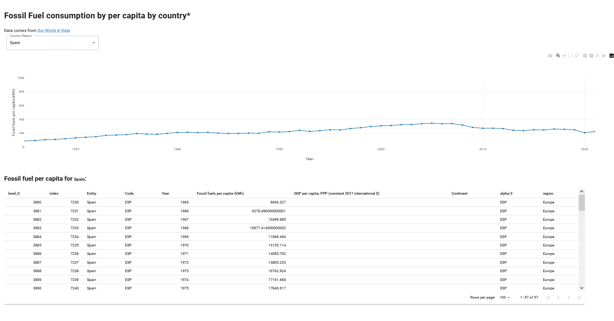

# Taipy Test

[](https://github.com/psf/black)


- [Taipy Test](#taipy-test)
  - [What is this app?](#what-is-this-app)
  - [Medium Article](#medium-article)
  - [Data sources](#data-sources)

## What is this app?

This is a minimal app using Taipy to test it.

This mini-application doesn't use Taipy Scenario Management (formerly named "Taipy Core"). This application is a minimal example to display charts using Taipy and its Markdown syntax.

- ```main.py``` calls dashboard_fossil_fuels_consumption.py
- ```hello_taipy.py``` is just a Hello World app with Taipy

The dashboard app has a selector for Countries or regions of the world. Data about fossil fuel consumption, per capita, renders as a plot and in a table, for the selected country or region.

## Medium Article

I use this application [to write a Medium article introducing Taipy GUI](https://medium.com/better-programming/discovering-taipy-and-taipy-gui-e1b664765017).

> **IMPORTANT**: Since I creted the article, I've changed the code a little bit to clean it. I've also chnaged the environment management to make it with uv, and I've upgraded the packages.  
> I've also created a `python-api` branch, where I coded the app using Taipy's Python API, which I prefer (this didn't exist when I wrote the article). I've writtent [many articles about Taipy](https://medium.com/@ericnarro/list/taipy-0e2b6bbedeb1), some cover this Python API.

Here's the list of changes I made since I published the article:

- I added a `with` statement to the callback (`with state as s:`)
- I placed the variables under the main guard in `main.py`
- I created an `algorithms` directoryfor the logical code.
- I added `uv` and `ruff` related files and upgraded the Taipy version. This app still runs with Taipy 4.1.0
- Fixed some typos and made the code pass linters



## Data sources

The application uses:

- The dataset about [Per Capita fossil energy consumption vs. GDP from Our World in Data](https://ourworldindata.org/grapher/per-capita-fossil-energy-vs-gdp?).
- A CSV file with country codes and continents [from this GitHub repo](https://github.com/lukes/ISO-3166-Countries-with-Regional-Codes/blob/master/all/all.csv).
